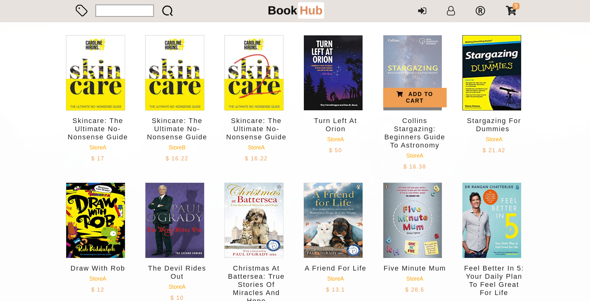

<h1 align="center">Bookhub</h1>

an online bookstore build on express and mariadb

## scrennshots




## directory

```
|- api/     captcha function
|- public/  public files including images and static pages
|- views/   dynamic pages, some ejs files
|- routes/  route control, only the index.js is used
|- bin/     express standard module
app.js      express standard module
```

## how to deploy

+ build project database

```sql
/* first connect to your mysql or mariadb */
create database bookhub;
use bookhub;
source {path to the project directory}/database/database.sql
```

then edit the `database/database.js`, change the username and password of your database admin

```javascript
var conn = mysql.createConnection({
  host: 'localhost',
  user: 'zds',
  password: 'zds',
  database: 'bookhub'
})
```


+ run the project

make sure you have nodemon installed or you should edit the package.json

```shell
npm install
npm run dev
```

